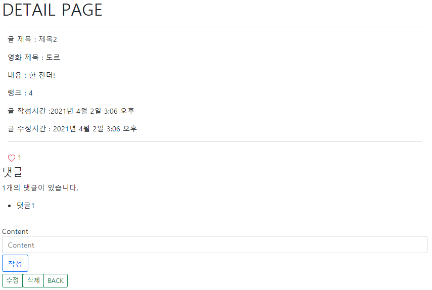

# Project7

> 관계형 데이터베이스 설계

### Django 마지막 프로젝트

> 오늘 프로젝트는 스켈레톤 코드가 있어, 편하게 프로젝트를 했다.

##### Models

```python
# accounts / models.py
from django.db import models
from django.contrib.auth.models import AbstractUser

class User(AbstractUser):
    followings = models.ManyToManyField('self', symmetrical=False, related_name='followers')
    
```

```python
# community / models.py
rom django.db import models
from django.conf import settings

# Create your models here.
class Review(models.Model):
    user = models.ForeignKey(settings.AUTH_USER_MODEL, on_delete=models.CASCADE)
    title = models.CharField(max_length=100)
    movie_title = models.CharField(max_length=50)
    rank = models.IntegerField()
    content = models.TextField()
    created_at = models.DateTimeField(auto_now_add=True)
    updated_at = models.DateTimeField(auto_now=True)
    like_users = models.ManyToManyField(settings.AUTH_USER_MODEL, related_name='like_reviews')
    
class Comment(models.Model):
    user = models.ForeignKey(settings.AUTH_USER_MODEL, on_delete=models.CASCADE)
    review = models.ForeignKey(Review, on_delete=models.CASCADE)
   content = models.CharField(max_length=100)

```

- User는 다른 User를 following할 수 있고, following를 하면 상대쪽에서 followers로 역참조 (N : M)
  - accounts_user_following라는 테이블과 from_user_id, to_user_id 필드가 그 안에 생성됨
- User와 Review & Review와 Comment는 1 : N 관계 
- Review 와 like_users
  - community_review_like_users라는 테이블과 review_id, user_id필드가 그 안에 생성됨.


##### Url, View

**1. accounts**

```python
    path('<int:user_id>/', views.profile, name='profile'),
    path('<int:user_id>/follow/', views.follow, name='follow'),
```

```python
def profile(request, user_id):
    # person : 어떤 user인지 정하기 위해, 지금 참조하고 있는 user가 필요함
    person = get_object_or_404(get_user_model(), pk=user_id)
    context = {
        'person': person,
    }
    return render(request, 'accounts/profile.html', context)

@require_POST
def follow(request, user_id):
    if request.user.is_authenticated:
     # you : 팔로우 할 사람. 지금 profile의 주인공 -  get_user_model(), pk=user_id
        you = get_object_or_404(get_user_model(), pk=user_id)
        me = request.user
        if you != me:
            
            if you.followers.filter(pk=me.pk).exists():
                # 팔로우 취소
                you.followers.remove(me)
            else:
                # 팔로우
                you.followers.add(me)
        return redirect('accounts:profile', user_id)
    else:
        return redirect('accounts:login')
```

- `if you.followers.filter(pk=me.pk).exists()`
  - 팔로우할 사람의 팔로워들 중에 나(현 요청자)가 존재 한다면 / 나를 pk로 식별함

**2. community**

```python
path('<int:review_pk>/like', views.like, name='like'),
```

```python
@require_POST
def like(request, review_pk):
    if request.user.is_authenticated:
        # 좋아요를 누를 게시물 
        review = get_object_or_404(Review, pk=review_pk)
        if review.like_users.filter(pk=request.user.pk).exists():
            # 좋아요 취소
            review.like_users.remove(request.user)
        else:
            # 좋아요
            review.like_users.add(request.user)
        return redirect('community:detail', review_pk)
    else:
        return redirect('accounts:login')
```

- `if review.like_users.filter(pk=request.user.pk).exists()`
  - 현 review를 좋아요 누를 사람들 중에 나(현 요청자)가 존재한다면 /  pk로 식별함


##### Templates

**로그인 하기 전**


**로그인 후**


- 작성자 - 프로필로 이동 / 글제목 - detail로 이동

**프로필 팔로우 하기 전**


**프로필 팔로잉 중**


**detail 좋아요 누르기 전**



**detail 좋아요 누른 후**


